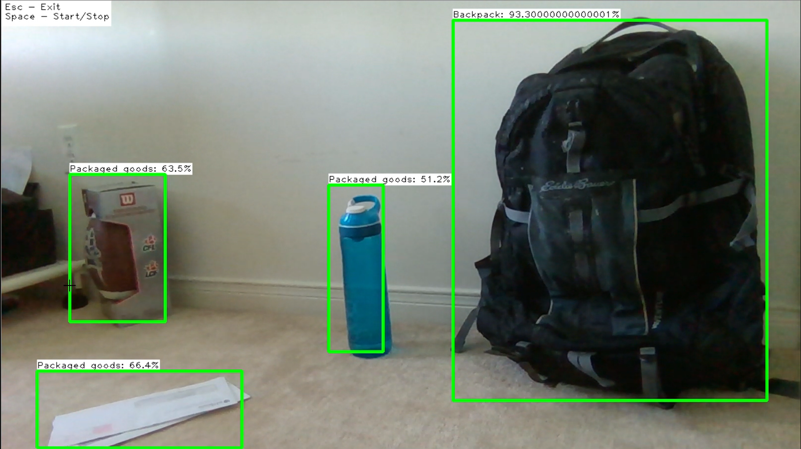
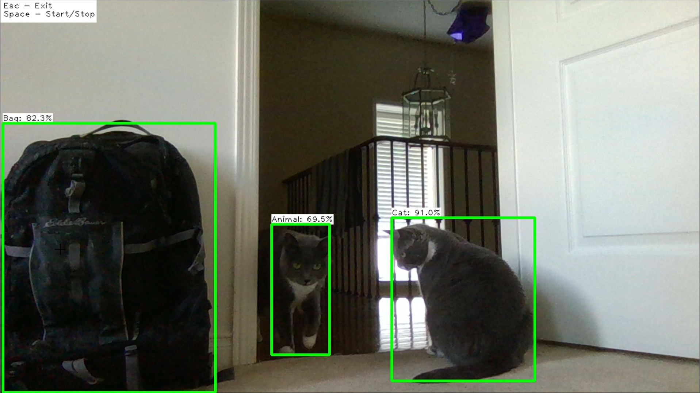
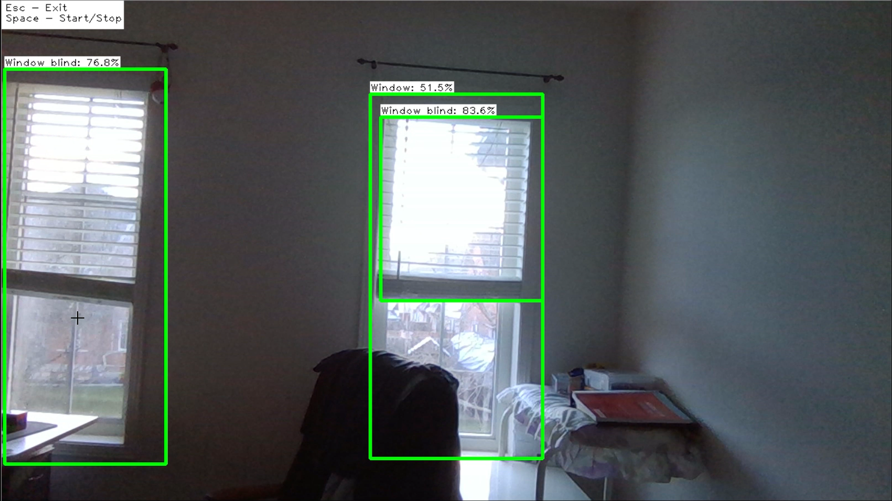

# Real-Time-Object-Detector

This is an Object Detector which uses the default camera on your system to locate and identify objects using Google Cloud Vision API. The program will identify objects around every second and update their last position on screen. The object type and confidence score will be on screen.

To use, download "real_time_object_detection.py". In the same directory, place an account token .json file and name it "Service_Account_Token.json". This will access the Google Cloud Vision API for object recognition. For more on getting the .json file, see https://cloud.google.com/vision/docs/setup under "Create a service account and download the private key file"

Instructions are on the top-left corner. ESC to exit, SPACE to start/stop, F to flip on x-axis (for when camera is facing you, so it looks like mirror)

Below are some examples of the program in use. Keep in mind that object detection has limiting factors. Camera resolution, camera movement, distance from object, lighting, and more can affect what the API returns and its accuracy. Also note that the delay is intentional so the API usage is reasonable within the free limit.

